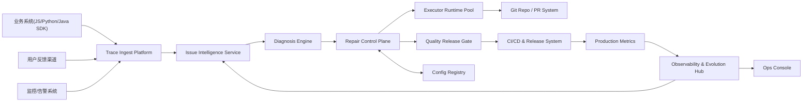

# Context Diagram

```mermaid
flowchart LR
U["业务系统(JS/Python/Java SDK)"] --> A["Trace Ingest Platform"]
F["用户反馈渠道"] --> A
M["监控/告警系统"] --> A

A --> B["Issue Intelligence Service"]
B --> C["Diagnosis Engine"]
C --> D["Repair Control Plane"]
D --> E["Executor Runtime Pool"]
E --> G["Git Repo / PR System"]
D --> H["Quality Release Gate"]
H --> I["CI/CD & Release System"]
I --> J["Production Metrics"]
J --> K["Observability & Evolution Hub"]
K --> B

D <--> L["Config Registry"]
K --> N["Ops Console"]
```

## 外部依赖
- Git 仓库与代码托管系统。
- CI/CD 发布系统。
- 监控告警系统。
- 执行器运行环境（多机）。
