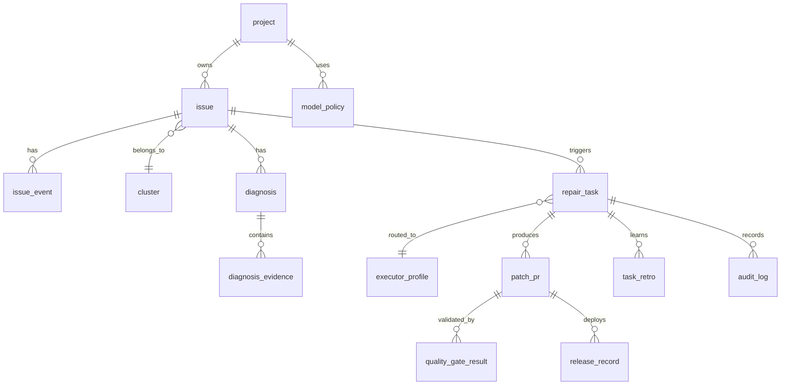

# ER Model

## 核心实体
- `project`：接入项目与仓库元信息。
- `issue`：标准化后的问题对象。
- `cluster`：问题聚类对象。
- `diagnosis`：诊断结论对象。
- `repair_task`：修复执行主对象。
- `patch_pr`：补丁 PR 对象。
- `quality_gate_result`：门禁结果。
- `release_record`：发布与回滚记录。
- `task_retro`：任务复盘记录。
- `audit_log`：审计记录。
