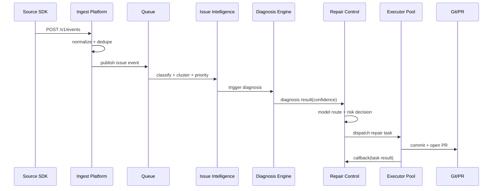
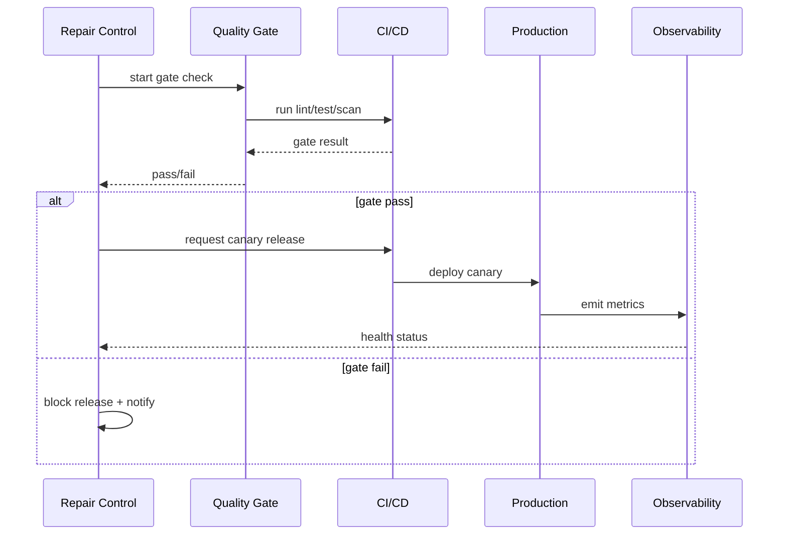
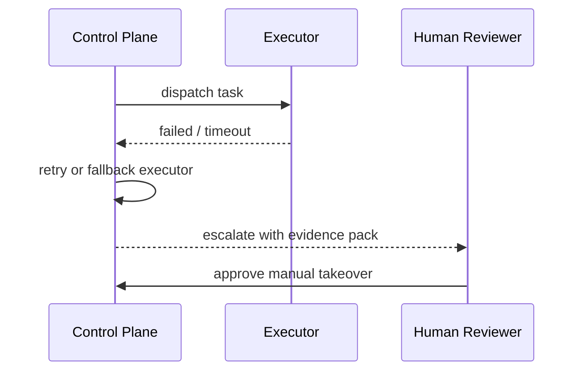

# Sequence Flows

## 1) 主流程：从事件到 PR

```mermaid
sequenceDiagram
    participant S as Source SDK
    participant I as Ingest Platform
    participant Q as Queue
    participant N as Issue Intelligence
    participant D as Diagnosis Engine
    participant C as Repair Control
    participant E as Executor Pool
    participant G as Git/PR

    S->>I: POST /v1/events
    I->>I: normalize + dedupe
    I->>Q: publish issue event
    Q->>N: classify + cluster + priority
    N->>D: trigger diagnosis
    D->>C: diagnosis result(confidence)
    C->>C: model route + risk decision
    C->>E: dispatch repair task
    E->>G: commit + open PR
    E->>C: callback(task result)
```

## 2) 门禁与发布流程

```mermaid
sequenceDiagram
    participant C as Repair Control
    participant QG as Quality Gate
    participant CI as CI/CD
    participant P as Production
    participant O as Observability

    C->>QG: start gate check
    QG->>CI: run lint/test/scan
    CI-->>QG: gate result
    QG-->>C: pass/fail
    alt gate pass
        C->>CI: request canary release
        CI->>P: deploy canary
        P->>O: emit metrics
        O-->>C: health status
    else gate fail
        C->>C: block release + notify
    end
```

## 3) 失败与接管流程

```mermaid
sequenceDiagram
    participant C as Control Plane
    participant E as Executor
    participant H as Human Reviewer

    C->>E: dispatch task
    E-->>C: failed / timeout
    C->>C: retry or fallback executor
    C-->>H: escalate with evidence pack
    H->>C: approve manual takeover
```
