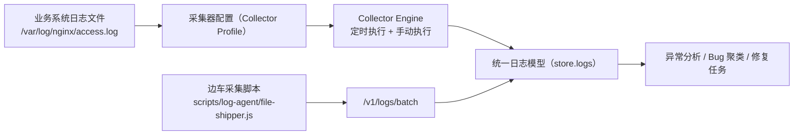

# Multi-Source Log Collection Design

## 1. 目标与问题

当前平台主要依赖业务系统主动调用 SDK/API 上报日志。对存量系统存在问题：

1. 无法快速改造老系统代码。
2. 运维希望直接复用现有 `/var/log/*`、`/data/logs/*` 日志文件。
3. 需要统一将日志归属到平台 `projectKey + service`，用于后续异常聚类与修复链路。

本方案新增“多采集模式”与“采集配置中心”，让平台同时支持：

1. SDK 主动推送（保留，推荐新系统）。
2. 平台侧拉取（本机文件、命令拉取、journald、OSS）。
3. 边车脚本推送（在业务服务器上运行附属采集脚本）。
4. Syslog HTTP 转发（rsyslog/syslog-ng 配置接入）。

## 2. 总体架构

## 3. 新增采集模式

### 3.1 `local_file`（本机文件增量采集）

适用场景：平台与业务日志在同一主机（或挂载了日志目录）。

核心参数：

1. `source.filePath`: 日志文件绝对路径。
2. `source.fromEndOnFirstRun`: 首次是否从文件末尾开始，避免一次性导入历史海量日志。
3. `source.maxReadBytes`: 单次读取上限，避免单次拉取过大。

### 3.2 `command_pull`（命令拉取）

适用场景：跨主机采集、存量环境不便部署 SDK。

核心参数：

1. `source.command`: 拉取命令，如 `ssh ops@10.0.0.8 'tail -n 500 /var/log/nginx/access.log'`。
2. `source.timeoutMs`: 命令超时。
3. `source.maxBuffer`: 命令输出缓冲上限。

说明：通过命令可以覆盖“录入服务器 IP + 日志路径自动拉取”的诉求。

### 3.3 `journald`（systemd 日志采集）

适用场景：Linux 服务由 systemd 托管，日志进入 journald。

核心参数：

1. `source.unit`: systemd unit 名称（如 `nginx.service`）。
2. `source.since`: 初始时间窗口（如 `10 minutes ago`）。
3. `source.lines`: 单次拉取上限。

### 3.4 `oss_pull`（对象存储拉取）

适用场景：系统已将日志归档到 OSS/S3/COS，平台按 URL 增量拉取。

核心参数：

1. `source.objectUrl`: 对象 URL（可用签名 URL）。
2. `source.headers`: 拉取所需 Header（如 Authorization）。
3. `source.maxReadBytes`: 单次增量拉取上限。

### 3.5 `syslog_http`（Syslog 转发）

适用场景：存量系统可通过 rsyslog/syslog-ng 转发，无需改应用代码。

核心参数：

1. `collectorKey`: 通过 `x-collector-key` 绑定采集器。
2. `source.token`（可选）：通过 `x-collector-token` 校验来源。
3. 推送接口：`POST /v1/logs/syslog`。

## 4. 统一归属模型（关键）

每个采集器强制配置：

1. `projectKey`：日志归属项目（对应修复仓库维度）。
2. `service`：日志归属服务（对应业务服务维度）。

采集入库后自动写入 `meta.projectKey`、`meta.collectorKey`、`meta.collectorMode`，保证后续分析与任务生成可追溯。

## 5. 常见日志体系解析策略

采集器支持 `parse.format`：

1. `auto`: 优先按 JSON 行解析，失败回退 plain。
2. `json`: 强制按 JSON 行解析。
3. `nginx_access`: 按 Nginx access log 结构解析（method/path/statusCode）。
4. `plain`: 文本行解析（关键字推断 level）。

推荐映射：

1. Nginx Access：`format=nginx_access`。
2. Java/Spring 文本日志：`format=plain` 或 `auto`。
3. Python JSON Logger：`format=json`。
4. Node pino/winston JSON：`format=json`。

## 6. 调度与运行

Collector Engine 负责：

1. 按 `pollIntervalSec` 定时执行启用采集器。
2. 支持手动触发 `POST /v1/config/log-collectors/{collectorKey}/run`。
3. 持久化采集游标 `state.cursor` 与最近运行状态。
4. 记录运行历史 `collectorRuns`（成功/失败、扫描行数、入库行数、错误）。

## 7. 新增 API

1. `POST /v1/logs/syslog`
2. `GET /v1/log-collectors/capabilities`
3. `GET /v1/config/log-collectors`
4. `POST /v1/config/log-collectors`
5. `DELETE /v1/config/log-collectors/{collectorKey}`
6. `POST /v1/config/log-collectors/{collectorKey}/run`
7. `GET /v1/log-collector-runs`
8. `GET /v1/system/collectors/state`

## 8. 前端配置页面

新增 `Collector Center` 页面，包含：

1. 采集配置表单（模式、归属、解析规则、过滤规则）。
2. 采集器列表（编辑/立即执行/删除）。
3. 最近运行记录列表（状态、扫描量、入库量、耗时、错误）。

## 9. 边车脚本模式

新增脚本：

`scripts/log-agent/file-shipper.js`

用途：

1. 在业务服务器本地读取日志文件增量内容。
2. 直接调用平台 `/v1/logs/batch` 推送。
3. 通过本地 cursor 文件记录读取位置。

适用于无法开通平台侧拉取权限的环境。

## 10. 运维建议

1. 新系统优先 SDK 上报；存量系统先用 Collector/边车方案过渡。
2. 首次接入建议 `fromEndOnFirstRun=true`，先观察增量稳定性再回补历史。
3. 为采集器配置 include/exclude 正则，降低噪声日志比例。
4. 将 `projectKey/service` 与修复系统仓库映射保持一致，提升自动修复命中率。
